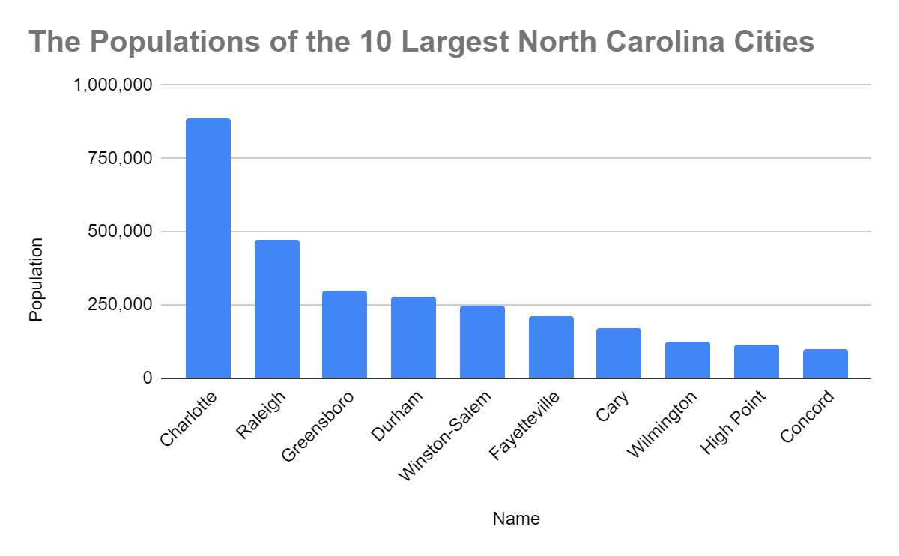

<!--
* @Author: Surejya Suresh
-->

### Weekly Challenge 4
Grade received 100%
&nbsp;

#### Question 1
In row 1 of the following spreadsheet, the words rank, name, population, and county are called what?

|    | A    | B             | C          | D                                     |
| -- | ---- | ------------- | ---------- | ------------------------------------- |
| 1  | Rank | Name          | Population | County                                |
| 2  | 1    | Charlotte     | 885,708    | Mecklenburg                           |
| 3  | 2    | Raleigh       | 474,069    | Wake (seat), Durham                   |
| 4  | 3    | Greensboro    | 296,710    | Guilford                              |
| 5  | 4    | Durham        | 278,993    | Durham (seat), Wake, Orange           |
| 6  | 5    | Winston-Salem | 247,945    | Forsyth                               |
| 7  | 6    | Fayetteville  | 211,657    | Cumberland                            |
| 8  | 7    | Cary          | 170,282    | Wake, Chatham                         |
| 9  | 8    | Wilmington    | 123,784    | New Hanover                           |
| 10 | 9    | High Point    | 112,791    | Guilford, Randolph, Davidson, Forsyth |
| 11 | 10   | Concord       | 96,341     | Cabarrus                              |

* Criteria
* **Attributes**
* Characteristics
* Descriptors
> These words are attributes, referring to the information in the columns below. An attribute is a characteristic or quality of data used to label a column in a table.

&nbsp;

#### Question 2
In the following spreadsheet, where can you find all of the attributes—also known as the observation—of Fayetteville?

|    | A    | B             | C          | D                                     |
| -- | ---- | ------------- | ---------- | ------------------------------------- |
| 1  | Rank | Name          | Population | County                                |
| 2  | 1    | Charlotte     | 885,708    | Mecklenburg                           |
| 3  | 2    | Raleigh       | 474,069    | Wake (seat), Durham                   |
| 4  | 3    | Greensboro    | 296,710    | Guilford                              |
| 5  | 4    | Durham        | 278,993    | Durham (seat), Wake, Orange           |
| 6  | 5    | Winston-Salem | 247,945    | Forsyth                               |
| 7  | 6    | Fayetteville  | 211,657    | Cumberland                            |
| 8  | 7    | Cary          | 170,282    | Wake, Chatham                         |
| 9  | 8    | Wilmington    | 123,784    | New Hanover                           |
| 10 | 9    | High Point    | 112,791    | Guilford, Randolph, Davidson, Forsyth |
| 11 | 10   | Concord       | 96,341     | Cabarrus                              |


* Column B
* Cell B7
* Row 6
* **Row 7**
> The observation for Fayetteville is in row 7. An observation is all of the attributes for something contained in a row of a data table.

&nbsp;

#### Question 3
Fill in the blank: In the following spreadsheet, the _____ feature was used to alphabetize the city names in column B.

|    | A    | B             | C          | D                                     |
| -- | ---- | ------------- | ---------- | ------------------------------------- |
| 1  | Rank | Name          | Population | County                                |
| 2  | 7    | Cary          | 170,282    | Wake, Chatham                         |
| 3  | 1    | Charlotte     | 885,708    | Mecklenburg                           |
| 4  | 10   | Concord       | 96,341     | Cabarrus                              |
| 5  | 4    | Durham        | 278,993    | Durham (seat), Wake, Orange           |
| 6  | 6    | Fayetteville  | 211,657    | Cumberland                            |
| 7  | 3    | Greensboro    | 296,710    | Guilford                              |
| 8  | 9    | High Point    | 112,791    | Guilford, Randolph, Davidson, Forsyth |
| 9  | 2    | Raleigh       | 474,069    | Wake (seat), Durham                   |
| 10 | 8    | Wilmington    | 123,784    | New Hanover                           |
| 11 | 5    | Winston-Salem | 247,945    | Forsyth                               |

* randomize range
* organize range
* name range
* **sort range**
> Sort range was used to alphabetize the city names in column B. Sorting a range of data from A to Z helps data analysts organize and find data more quickly.

&nbsp;

#### Question 4
A data analyst types =POPULATION(C2:C11) to find the average population of the cities in this spreadsheet. However, they realize they used the wrong formula. What syntax will correct this function?

|    | A    | B             | C          | D                                     |
| -- | ---- | ------------- | ---------- | ------------------------------------- |
| 1  | Rank | Name          | Population | County                                |
| 2  | 1    | Charlotte     | 885,708    | Mecklenburg                           |
| 3  | 2    | Raleigh       | 474,069    | Wake (seat), Durham                   |
| 4  | 3    | Greensboro    | 296,710    | Guilford                              |
| 5  | 4    | Durham        | 278,993    | Durham (seat), Wake, Orange           |
| 6  | 5    | Winston-Salem | 247,945    | Forsyth                               |
| 7  | 6    | Fayetteville  | 211,657    | Cumberland                            |
| 8  | 7    | Cary          | 170,282    | Wake, Chatham                         |
| 9  | 8    | Wilmington    | 123,784    | New Hanover                           |
| 10 | 9    | High Point    | 112,791    | Guilford, Randolph, Davidson, Forsyth |
| 11 | 10   | Concord       | 96,341     | Cabarrus                              |

* **=AVERAGE(C2:C11)**
* AVERAGE(C2:C11)
* =AVERAGE(C2-C11)
* AVERAGE(C2-C11)
> The correct AVERAGE function syntax is =AVERAGE(C2:C11). AVERAGE returns an average of values from a selected range. C2:C11 is the specified range.

&nbsp;

#### Question 5
You are working with a database table named genre that contains data about music genres. You want to review all the columns in the table.

You write the SQL query below. Add a FROM clause that will retrieve the data from the genre table.

```
SELECT
*
```

What is the name of the genre with ID number 3?
* Blues
* Rock
* Jazz
* **Metal**
> The clause FROM genre will retrieve the data from the genre table. The complete query is SELECT * FROM genre. The FROM clause specifies which database table to query. The name of the genre with ID number 3 is Metal.

&nbsp;

#### Question 6
Question 6
You are working with a database table that contains invoice data. The customer_id column lists the ID number for each customer. You are interested in invoice data for the customer with ID number 54.
You write the SQL query below. Add a WHERE clause that will return only data about the customer with ID number 54.

```
SELECT
*
FROM
invoice
```

After you run your query, use the slider to view all the data presented.
What is the billing address for the customer with ID number 54?
* 230 Elgin St
* 1033 N Park Ave
* 801 W 4th St
* **110 Raeburn Pl**
> The clause WHERE customer_id = 54 will return only data about the customer with ID number 54. The complete query is SELECT * FROM invoice WHERE customer_id = 54. The WHERE clause filters results that meet certain conditions. The WHERE clause includes the name of the column, an equals sign, and the value(s) in the column to include. The billing address for the customer with ID number 54 is 110 Raeburn Pl.

&nbsp;


#### Question 7
A data analyst creates the following visualization to clearly demonstrate how much more populous Charlotte is than the next-largest North Carolina city, Raleigh. It’s called a line chart.
* True
* **False**
> This is a column chart. A column chart is effective at demonstrating the differences between several items in a specific range of values.

&nbsp;

#### Question 8
A data analyst wants to demonstrate a trend of how something has changed over time. What type of chart is best for this task?




* Column
* Area
* Bar
* **Line**
> Line charts are effective for illustrating trends and patterns, such as how something changes over time.

&nbsp;
